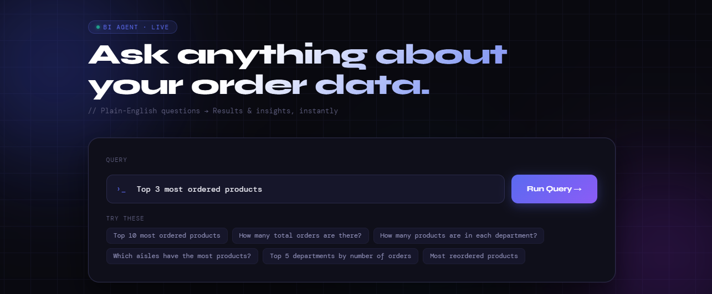
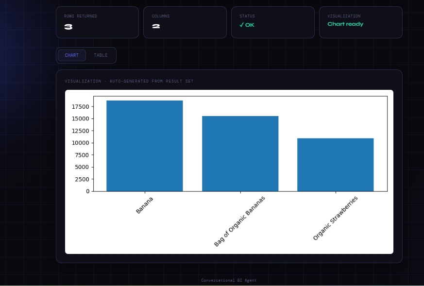
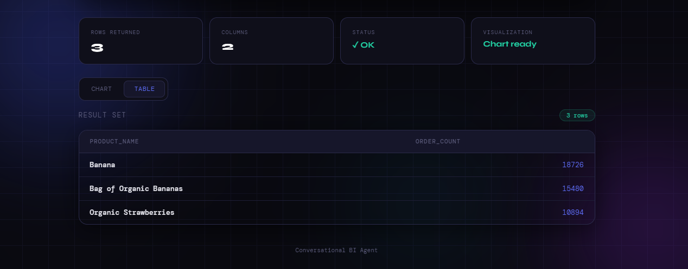

# Conversational BI Agent

A Conversational Business Intelligence (BI) Agent that allows users to query datasets using natural language.
The system converts user questions into SQL queries using an LLM, executes them on DuckDB, and visualizes results with charts.

---

# Project Overview

This project demonstrates how natural language queries can be converted into structured SQL queries to analyze business data.

Example:

User Input:

```
Top 10 most ordered products
```

Generated SQL:

```
SELECT p.product_name, COUNT(op.order_id) AS order_count
FROM order_products_prior op
JOIN products p ON op.product_id = p.product_id
GROUP BY p.product_name
ORDER BY order_count DESC
LIMIT 10;
```

The result is displayed as a table and chart in a web interface.

---

# Architecture

```
User Question
      ↓
Flask Web Interface
      ↓
LLM Query Generator
      ↓
SQL Query
      ↓
DuckDB Execution
      ↓
Pandas DataFrame
      ↓
Chart Generator
      ↓
Table + Visualization
```


---

# Tech Stack

Python
Flask
DuckDB
Pandas
Groq LLM
Matplotlib
HTML / Jinja Templates

---


# Dataset

Download the Instacart dataset from:
https://www.kaggle.com/datasets/psparks/instacart-market-basket-analysis


After downloading, place the CSV files in the `data/` folder.

# Installation

Clone the repository

```
git clone https://github.com/Ajeya-Bendigeri/bi-agent.git
cd bi-agent
```

Create virtual environment

```
python -m venv .venv
```

Activate environment

Windows:

```
.venv\Scripts\activate
```

Install dependencies

```
pip install -r requirements.txt
```

---

# Environment Variables

Create `.env` file:

```
GROQ_API_KEY=your_api_key_here
```

---

# Run the Application

```
python app.py
```

Open browser:

```
http://127.0.0.1:5000
```

---

# Example Queries

Top 10 most ordered products
Show departments
Total number of orders
Top products by order count

---

# output
1. SQL Query

This screen allows users to enter their queries in plain English instead of writing SQL manually.



2. Chat interface

This screen shows the user interaction interface where users can ask questions about the dataset in natural language.




3. Query Result Table

The table shows the data returned from DuckDB, allowing users to easily inspect the analytical results.


